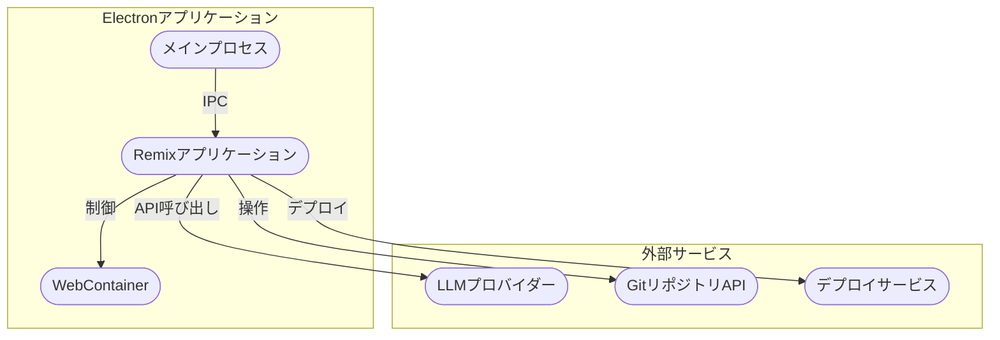
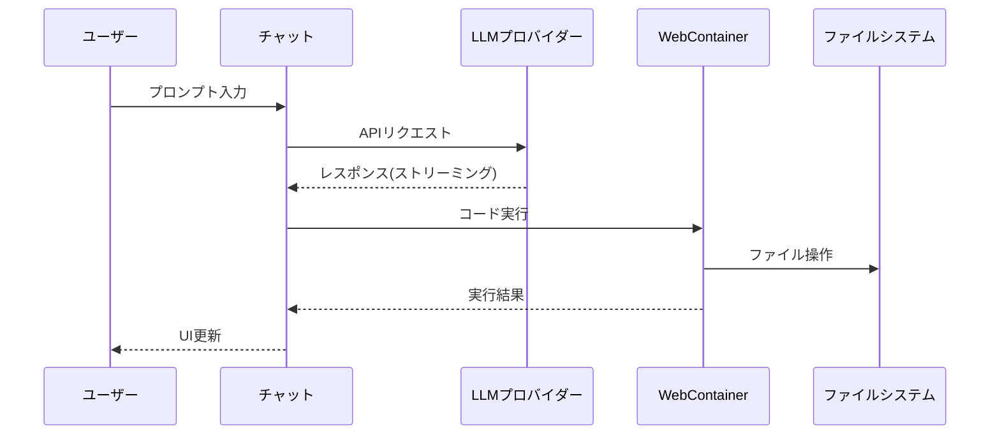

# Bolt.diy アプリケーション構造解析

## 1. アプリケーション概要

Bolt.diyは、ブラウザ上でAIを活用したフルスタック Web開発を可能にするElectronベースのデスクトップアプリケーションです。

## 2. システムアーキテクチャ



## 3. 主要コンポーネント構成

### 3.1 メインプロセス (electron/main/index.ts)
- Electronアプリケーションの初期化
- プロトコルハンドラーの設定
- ウィンドウ管理
- IPC通信の制御
- 自動アップデート機能

### 3.2 フロントエンド (app/)


### 3.3 APIルート構成


## 4. 主要ユースケース

### 4.1 AIアシスタントとの対話

#### 4.1.1 リクエスト処理フロー
1. ユーザープロンプト入力処理 (`app/components/chat/Chat.client.tsx`)
   - プロンプトにモデルとプロバイダー情報を付加
   - ファイルコンテキストの収集
   - APIリクエストの準備

2. チャットAPI処理 (`app/routes/api.chat.ts`)
   - チャットコンテキストの最適化
     - チャット履歴のサマリー生成
     - 関連ファイルの選択
   - トークン使用量の追跡
   - ストリーミングレスポンスの設定

3. LLMとの通信 (`app/lib/.server/llm/stream-text.ts`)
   - プロバイダー・モデルの設定
   - システムプロンプトの構築
   - メッセージフォーマットの正規化
   - ストリーミングレスポンスの処理

#### 4.1.2 エラーハンドリング
1. API認証エラー
   ```typescript
   if (error.message?.includes('API key')) {
     throw new Response('Invalid or missing API key', {
       status: 401,
       statusText: 'Unauthorized',
     });
   }
   ```

2. メッセージフォーマットエラー
   ```typescript
   if (error.message.includes('messages must be an array of CoreMessage or UIMessage')) {
     // フォールバックフォーマットでリトライ
     const fallbackMessages = processedMessages.map(msg => ({
       role: msg.role,
       content: [{ type: 'text', text: String(msg.content || '') }]
     }));
   }
   ```

3. トークン制限エラー
   - MAX_RESPONSE_SEGMENTSを超えた場合の処理
   - 継続メッセージの生成（CONTINUE_PROMPT）

#### 4.1.3 コード生成・実行フロー
1. レスポンス処理 (`app/routes/api.chat.ts`)
   - ストリーミングレスポンスの受信
   - マークダウンとコードブロックの解析
   - HTMLエレメントの許可リストによるフィルタリング

2. WebContainerの初期化 (`app/lib/webcontainer/index.ts`)
   ```typescript
   WebContainer.boot({
     coep: 'credentialless',
     workdirName: WORK_DIR_NAME,
     forwardPreviewErrors: true
   });
   ```

3. ファイル操作処理 (`app/lib/stores/workbench.ts`)
   - ファイルの作成・更新
   ```typescript
   async createFile(filePath: string, content: string | Uint8Array = '') {
     const success = await this.#filesStore.createFile(filePath, content);
     if (success) {
       this.setSelectedFile(filePath);
     }
   }
   ```
   - ファイルの保存と変更監視
   ```typescript
   async saveFile(filePath: string) {
     await this.#filesStore.saveFile(filePath, document.value);
     const newUnsavedFiles = new Set(this.unsavedFiles.get());
     newUnsavedFiles.delete(filePath);
   }
   ```

4. アクション実行管理
   - ActionRunnerによる実行制御
   ```typescript
   const artifact = {
     runner: new ActionRunner(
       webcontainer,
       () => this.boltTerminal,
       (alert) => this.actionAlert.set(alert)
     )
   }
   ```
   - 実行キューの管理
   ```typescript
   addToExecutionQueue(callback: () => Promise<void>) {
     this.#globalExecutionQueue = this.#globalExecutionQueue.then(() => callback());
   }
   ```

5. エラーハンドリング
   - プレビューエラーの検知と通知
   ```typescript
   webcontainer.on('preview-message', (message) => {
     if (message.type === 'PREVIEW_UNCAUGHT_EXCEPTION') {
       workbenchStore.actionAlert.set({
         type: 'preview',
         title: 'Uncaught Exception',
         description: message.message,
         content: message.stack
       });
     }
   });
   ```

### 4.2 プロジェクト管理
1. プロジェクトの作成/インポート
   - ブランクプロジェクト作成
   - Gitリポジトリからのクローン
   - スターターテンプレートの利用
2. ファイル編集とプレビュー
3. バージョン管理（Git統合）
4. デプロイ（Netlify/Vercel等）

### 4.3 設定管理
- LLMプロバイダーの設定
- APIキーの管理
- UIテーマ設定
- プロジェクト設定

## 5. データフロー



## 6. 技術スタック

- **フレームワーク**: Electron, Remix
- **言語**: TypeScript
- **UI**: React
- **実行環境**: WebContainer
- **状態管理**: Nanostores
- **その他**:
  - Vite (開発環境)
  - ESLint/Prettier (コード品質)
  - pnpm (パッケージ管理)

## 7. セキュリティ考慮事項

- APIキーの安全な保存
- プロバイダーベースURLのカスタマイズ
- サードパーティ統合の認証管理
- ローカルファイルシステムのアクセス制御

## 8. 拡張性

アプリケーションは以下の面で高い拡張性を持っています：

1. **LLMプロバイダー**
   - 新規プロバイダーの追加が容易
   - カスタムベースURLのサポート

2. **デプロイ統合**
   - 複数のデプロイプラットフォームサポート
   - カスタムデプロイ設定

3. **プロジェクトテンプレート**
   - スターターテンプレートの追加
   - カスタムテンプレート対応
