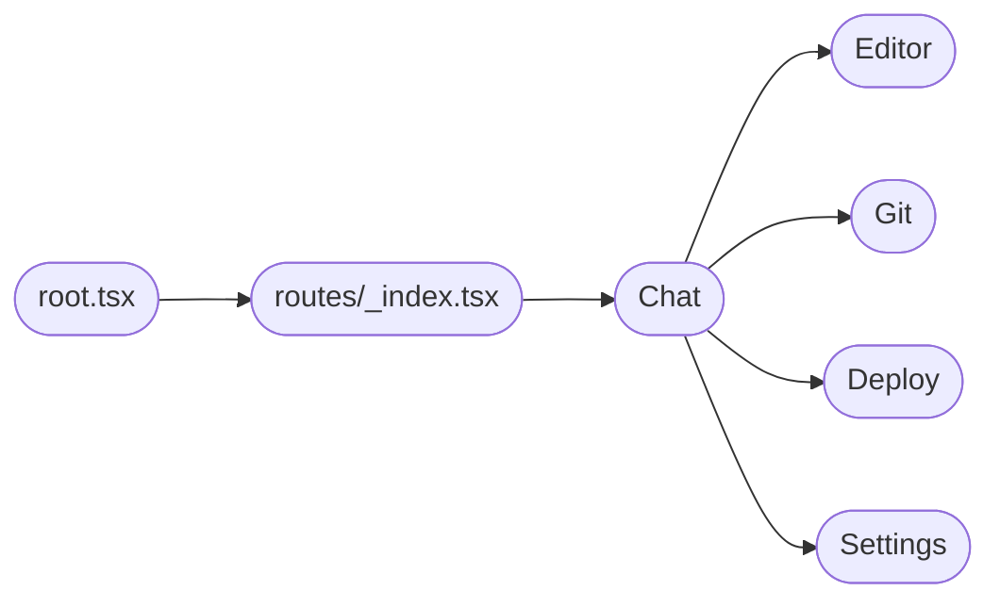
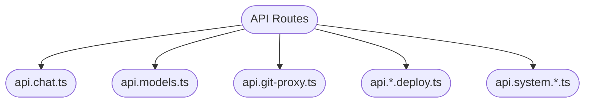
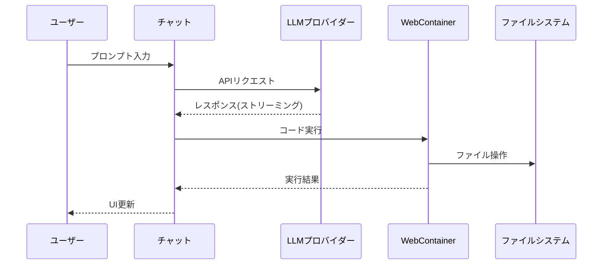

# Bolt.diy アプリケーション構造解析

## 1. アプリケーション概要

Bolt.diyは、ブラウザ上でAIを活用したフルスタック Web開発を可能にするElectronベースのデスクトップアプリケーションです。

## 2. システムアーキテクチャ


## 3. 主要コンポーネント構成

### 3.1 メインプロセス (electron/main/index.ts)
- Electronアプリケーションの初期化
- プロトコルハンドラーの設定
- ウィンドウ管理
- IPC通信の制御
- 自動アップデート機能

### 3.2 フロントエンド (app/)


### 3.3 APIルート構成


## 5. データフロー



## 4. 主要ユースケース

### 4.1 AIアシスタントとの対話

#### 4.1.1 リクエスト処理フロー
1. ユーザープロンプト入力処理 (`app/components/chat/Chat.client.tsx`, `app/components/chat/BaseChat.tsx`)
   
   a. プロンプト入力制御
   ```typescript
   const { messages, input, handleInputChange, setInput, append } = useChat({
     api: '/api/chat',
     body: {
       apiKeys,
       files,
       promptId,
       contextOptimization: contextOptimizationEnabled
     }
   });
   ```

   b. プロンプト前処理
   ```typescript
   const sendMessage = async (_event: React.UIEvent, messageInput?: string) => {
     const messageContent = messageInput || input;
     if (!messageContent?.trim()) return;

     if (!chatStarted) {
       setFakeLoading(true);
       // スターターテンプレートの選択処理
       const { template, title } = await selectStarterTemplate({
         message: messageContent,
         model,
         provider
       });
     }
   }
   ```

   c. メッセージフォーマット
   ```typescript
   append({
     role: 'user',
     content: [
       {
         type: 'text',
         text: `[Model: ${model}]\n\n[Provider: ${provider.name}]\n\n${messageContent}`
       },
       ...imageDataList.map((imageData) => ({
         type: 'image',
         image: imageData
       }))
     ]
   });
   ```

   d. コンテキスト管理
   ```typescript
   // ファイル変更の追跡
   const modifiedFiles = workbenchStore.getModifiedFiles();
   if (modifiedFiles !== undefined) {
     const userUpdateArtifact = filesToArtifacts(modifiedFiles, `${Date.now()}`);
     // 変更されたファイルの情報をプロンプトに追加
   }
   ```

   e. 入力状態の管理
   ```typescript
   // 入力内容のキャッシュ
   const debouncedCachePrompt = useCallback(
     debounce((event: React.ChangeEvent<HTMLTextAreaElement>) => {
       const trimmedValue = event.target.value.trim();
       Cookies.set(PROMPT_COOKIE_KEY, trimmedValue, { expires: 30 });
     }, 1000),
     []
   );

   // テキストエリアのリサイズ処理
   useEffect(() => {
     const textarea = textareaRef.current;
     if (textarea) {
       textarea.style.height = 'auto';
       const scrollHeight = textarea.scrollHeight;
       textarea.style.height = `${Math.min(scrollHeight, TEXTAREA_MAX_HEIGHT)}px`;
     }
   }, [input, textareaRef]);
   ```

2. チャットAPI処理 (`app/routes/api.chat.ts`)

   a. リクエストの受信と解析
   ```typescript
   async function chatAction({ context, request }: ActionFunctionArgs) {
     const { messages, files, promptId, contextOptimization, supabase } = await request.json();
     const cookieHeader = request.headers.get('Cookie');
     const apiKeys = JSON.parse(parseCookies(cookieHeader || '').apiKeys || '{}');
   }
   ```

   b. チャットコンテキストの最適化
   ```typescript
   // チャット履歴のサマリー生成
   const summary = await createSummary({
     messages: [...messages],
     env: context.cloudflare?.env,
     apiKeys,
     providerSettings,
     promptId,
     contextOptimization,
     onFinish(resp) {
       if (resp.usage) {
         cumulativeUsage.completionTokens += resp.usage.completionTokens || 0;
         cumulativeUsage.promptTokens += resp.usage.promptTokens || 0;
       }
     }
   });

   // 関連ファイルの選択
   const filteredFiles = await selectContext({
     messages: [...messages],
     env: context.cloudflare?.env,
     apiKeys,
     files,
     providerSettings,
     promptId,
     contextOptimization,
     summary
   });
   ```

   c. ストリーミングレスポンスの設定
   ```typescript
   const dataStream = createDataStream({
     async execute(dataStream) {
       dataStream.writeData({
         type: 'progress',
         label: 'response',
         status: 'in-progress',
         message: 'Generating Response'
       });

       const result = await streamText({
         messages,
         env: context.cloudflare?.env,
         options,
         apiKeys,
         files,
         providerSettings,
         promptId,
         contextOptimization,
         contextFiles: filteredFiles,
         summary
       });

       result.mergeIntoDataStream(dataStream);
     }
   });
   ```

   d. エラー処理とリカバリー
   ```typescript
   try {
     // ストリーミング処理
   } catch (error: any) {
     if (error.message?.includes('API key')) {
       throw new Response('Invalid or missing API key', {
         status: 401,
         statusText: 'Unauthorized'
       });
     }
     throw new Response(null, {
       status: 500,
       statusText: 'Internal Server Error'
     });
   }
   ```

   e. トークン使用量の追跡
   ```typescript
   const cumulativeUsage = {
     completionTokens: 0,
     promptTokens: 0,
     totalTokens: 0
   };

   // 使用量の記録
   dataStream.writeMessageAnnotation({
     type: 'usage',
     value: {
       completionTokens: cumulativeUsage.completionTokens,
       promptTokens: cumulativeUsage.promptTokens,
       totalTokens: cumulativeUsage.totalTokens
     }
   });
   ```

3. LLMとの通信 (`app/lib/.server/llm/stream-text.ts`)

   a. プロバイダー・モデルの設定
   ```typescript
   const provider = PROVIDER_LIST.find((p) => p.name === currentProvider) || DEFAULT_PROVIDER;
   const modelDetails = provider.staticModels.find((m) => m.name === currentModel);
   if (!modelDetails) {
     const modelsList = await LLMManager.getInstance().getModelListFromProvider(provider, {
       apiKeys,
       providerSettings,
       serverEnv
     });
     modelDetails = modelsList.find((m) => m.name === currentModel) || modelsList[0];
   }
   ```

   b. システムプロンプトの構築
   ```typescript
   let systemPrompt = PromptLibrary.getPropmtFromLibrary(promptId || 'default', {
     cwd: WORK_DIR,
     allowedHtmlElements,
     modificationTagName: MODIFICATIONS_TAG_NAME,
     supabase: {
       isConnected: options?.supabaseConnection?.isConnected || false,
       hasSelectedProject: options?.supabaseConnection?.hasSelectedProject || false
     }
   });

   if (files && contextFiles && contextOptimization) {
     const codeContext = createFilesContext(contextFiles, true);
     systemPrompt = `${systemPrompt}
       Below is the artifact containing the context:
       ---
       ${codeContext}
       ---
     `;
   }
   ```

   c. メッセージの正規化とマルチモーダル対応
   ```typescript
   const hasMultimodalContent = originalMessages.some((msg) => Array.isArray(msg.content));
   if (hasMultimodalContent) {
     const multimodalMessages = originalMessages.map((msg) => ({
       role: msg.role === 'system' || msg.role === 'user' || msg.role === 'assistant' ? msg.role : 'user',
       content: Array.isArray(msg.content)
         ? msg.content.map((item) => {
             if (item.type === 'image') {
               return { type: 'image', image: item.image };
             }
             return { type: 'text', text: item.text || '' };
           })
         : [{ type: 'text', text: String(msg.content || '') }]
     }));
   }
   ```

   d. ストリーミングレスポンスの処理
   ```typescript
   return await _streamText({
     model: provider.getModelInstance({
       model: modelDetails.name,
       serverEnv,
       apiKeys,
       providerSettings
     }),
     system: systemPrompt,
     maxTokens: dynamicMaxTokens,
     messages: convertToCoreMessages(normalizedTextMessages),
     ...options
   });
   ```

   e. エラーリカバリー処理
   ```typescript
   try {
     // 通常のストリーミング処理
   } catch (error) {
     if (error.message?.includes('messages must be an array')) {
       // フォーマットエラーの場合、フォールバック形式を試行
       const fallbackMessages = processedMessages.map(msg => ({
         role: msg.role,
         content: [{
           type: 'text',
           text: typeof msg.content === 'string' ? msg.content : String(msg.content || '')
         }]
       }));
       return await _streamText({ /* フォールバックオプション */ });
     }
     throw error;
   }
   ```

#### 4.1.2 エラーハンドリング
1. API認証エラー
   ```typescript
   if (error.message?.includes('API key')) {
     throw new Response('Invalid or missing API key', {
       status: 401,
       statusText: 'Unauthorized',
     });
   }
   ```

2. メッセージフォーマットエラー
   ```typescript
   if (error.message.includes('messages must be an array of CoreMessage or UIMessage')) {
     // フォールバックフォーマットでリトライ
     const fallbackMessages = processedMessages.map(msg => ({
       role: msg.role,
       content: [{ type: 'text', text: String(msg.content || '') }]
     }));
   }
   ```

3. トークン制限エラー
   - MAX_RESPONSE_SEGMENTSを超えた場合の処理
   - 継続メッセージの生成（CONTINUE_PROMPT）

#### 4.1.3 コード生成・実行フロー
1. レスポンス処理 (`app/routes/api.chat.ts`)
   - ストリーミングレスポンスの受信
   - マークダウンとコードブロックの解析
   - HTMLエレメントの許可リストによるフィルタリング

2. WebContainerの初期化 (`app/lib/webcontainer/index.ts`, `app/lib/stores/previews.ts`)
   ```typescript
   WebContainer.boot({
     coep: 'credentialless',
     workdirName: WORK_DIR_NAME,
     forwardPreviewErrors: true
   });
   ```

3. ファイル操作処理 (`app/lib/stores/workbench.ts`, `app/lib/stores/files.ts`)
   - ファイルの作成・更新
   ```typescript
   async createFile(filePath: string, content: string | Uint8Array = '') {
     const success = await this.#filesStore.createFile(filePath, content);
     if (success) {
       this.setSelectedFile(filePath);
     }
   }
   ```
   - ファイルの保存と変更監視
   ```typescript
   async saveFile(filePath: string) {
     await this.#filesStore.saveFile(filePath, document.value);
     const newUnsavedFiles = new Set(this.unsavedFiles.get());
     newUnsavedFiles.delete(filePath);
   }
   ```

4. アクション実行管理 (`app/lib/runtime/action-runner.ts`)
   - ActionRunnerによる実行制御
   ```typescript
   const artifact = {
     runner: new ActionRunner(
       webcontainer,
       () => this.boltTerminal,
       (alert) => this.actionAlert.set(alert)
     )
   }
   ```
   - 実行キューの管理
   ```typescript
   addToExecutionQueue(callback: () => Promise<void>) {
     this.#globalExecutionQueue = this.#globalExecutionQueue.then(() => callback());
   }
   ```

5. エラーハンドリング
   - プレビューエラーの検知と通知
   ```typescript
   webcontainer.on('preview-message', (message) => {
     if (message.type === 'PREVIEW_UNCAUGHT_EXCEPTION') {
       workbenchStore.actionAlert.set({
         type: 'preview',
         title: 'Uncaught Exception',
         description: message.message,
         content: message.stack
       });
     }
   });
   ```

### 4.2 プロジェクト管理

#### 4.2.1 プロジェクトの作成/インポート
1. ブランクプロジェクト作成
   - WebContainerでの作業ディレクトリ初期化
   - 基本ファイル構造の生成

2. Gitリポジトリからのクローン
   - リポジトリURLの解析
   - WebContainer上でのgitコマンド実行
   - ファイルシステムへの展開

3. スターターテンプレートの利用
   - テンプレートの選択と初期化
   - 設定ファイルの自動生成

#### 4.2.2 GitHubとの連携 (`app/lib/stores/workbench.ts`)
```typescript
async pushToGitHub(repoName: string, commitMessage?: string, isPrivate: boolean = false) {
  // リポジトリの作成または取得
  const octokit = new Octokit({ auth: githubToken });
  const repo = await octokit.repos.createForAuthenticatedUser({
    name: repoName,
    private: isPrivate,
    auto_init: true
  });

  // ファイルのプッシュ
  const blobs = await Promise.all(
    Object.entries(files).map(async ([filePath, dirent]) => {
      if (dirent?.type === 'file') {
        const { data: blob } = await octokit.git.createBlob({
          owner: repo.owner.login,
          repo: repo.name,
          content: Buffer.from(dirent.content).toString('base64'),
          encoding: 'base64'
        });
        return { path: extractRelativePath(filePath), sha: blob.sha };
      }
    })
  );
}
```

#### 4.2.3 デプロイ機能 (`app/lib/modules/deploy/providers/`)
1. Netlifyデプロイ (`app/lib/modules/deploy/providers/netlify.ts`)
   - プロジェクトのビルド
   - デプロイ設定の生成
   - Netlify APIとの連携

2. Vercelデプロイ (`app/lib/modules/deploy/providers/vercel.ts`)
   - 環境変数の設定
   - プロジェクト設定の最適化
   - Vercel APIを使用したデプロイ

3. エラーハンドリング (`app/components/chat/ChatAlert.tsx`, `app/lib/error/handlers.ts`)
   ```typescript
   if (error.message?.includes('rate limit')) {
     toast.warning('Rate limit exceeded. Skipping starter template');
   } else {
     toast.warning('Failed to import starter template');
   }
   ```

### 4.3 設定管理

#### 4.3.1 APIキー管理
1. 安全な保存
   ```typescript
   // APIキーをクッキーに保存
   Cookies.set('apiKeys', JSON.stringify({
     openai: 'sk-...',
     anthropic: 'sk-...'
   }), { expires: 30 });

   // APIキーの取得
   const apiKeys = JSON.parse(Cookies.get('apiKeys') || '{}');
   ```

2. プロバイダー設定
   ```typescript
   const providerSettings: Record<string, IProviderSetting> = JSON.parse(
     parseCookies(cookieHeader || '').providers || '{}'
   );
   ```

#### 4.3.2 LLMプロバイダーの設定 (`app/lib/modules/llm/manager.ts`)
1. モデル選択
   ```typescript
   const provider = PROVIDER_LIST.find((p) => p.name === currentProvider) || DEFAULT_PROVIDER;
   const modelDetails = provider.staticModels.find((m) => m.name === currentModel);
   ```

2. パラメータ設定
   ```typescript
   const dynamicMaxTokens = modelDetails?.maxTokenAllowed || MAX_TOKENS;
   ```

#### 4.3.3 UIテーマ設定 (`app/components/theme/ThemeProvider.tsx`)
- ダークモード/ライトモードの切り替え (`app/components/theme/ThemeSwitch.tsx`)
- カスタムテーマの適用 (`app/lib/stores/theme.ts`)
- アニメーション設定 (`app/styles/animations.css`)

#### 4.3.4 プロジェクト設定
1. プロジェクト環境設定
   ```typescript
   const systemPrompt = PromptLibrary.getPropmtFromLibrary(promptId || 'default', {
     cwd: WORK_DIR,
     allowedHtmlElements: allowedHTMLElements,
     modificationTagName: MODIFICATIONS_TAG_NAME
   });
   ```

2. デプロイ設定
   - Netlify/Vercel設定の管理
   - 環境変数の設定
   - ビルド設定のカスタマイズ

## 6. 技術スタック

- **フレームワーク**: Electron, Remix
- **言語**: TypeScript
- **UI**: React
- **実行環境**: WebContainer
- **状態管理**: Nanostores
- **その他**:
  - Vite (開発環境)
  - ESLint/Prettier (コード品質)
  - pnpm (パッケージ管理)

## 7. セキュリティ考慮事項

### 7.1 APIキー管理
- クッキーベースの暗号化保存
  ```typescript
  // APIキーの暗号化保存
  Cookies.set('apiKeys', JSON.stringify(encryptedKeys), {
    expires: 30,
    secure: true,
    sameSite: 'strict'
  });
  ```
- トークンの有効期限管理
- セッション単位での一時保存

### 7.2 サードパーティ認証
- OAuth2.0フローの実装
  - GitHubトークンの管理
  - Netlify/Vercel認証統合
- スコープ制限とアクセス制御

### 7.3 ファイルシステムセキュリティ
1. WebContainer分離
   ```typescript
   WebContainer.boot({
     coep: 'credentialless',
     workdirName: WORK_DIR_NAME,
     forwardPreviewErrors: true
   });
   ```

2. ローカルファイルアクセス制御
   - 作業ディレクトリの制限
   - 許可されたファイル操作のみ実行
   - バイナリファイルの安全な処理

### 7.4 通信セキュリティ
- HTTPSプロトコルの強制
- クロスオリジンリソース制限
- WebSocket接続の保護

## 8. 拡張性

### 8.1 LLMプロバイダーの拡張
1. プロバイダー実装のインターフェース
   ```typescript
   interface ILLMProvider {
     name: string;
     staticModels: ModelInfo[];
     getModelInstance: (config: {
       model: string;
       serverEnv: any;
       apiKeys: Record<string, string>;
       providerSettings: Record<string, IProviderSetting>;
     }) => any;
   }
   ```

2. カスタムベースURL設定
   ```typescript
   const providerSettings = {
     baseUrl: customBaseUrl,
     apiVersion: 'v1',
     options: {
       temperature: 0.7,
       maxTokens: 2048
     }
   };
   ```

### 8.2 デプロイ統合の拡張
1. デプロイプラットフォーム追加
   ```typescript
   interface IDeployProvider {
     name: string;
     deploy: (config: {
       files: FileMap;
       settings: Record<string, any>;
       token: string;
     }) => Promise<{
       url: string;
       logs: string[];
     }>;
   }
   ```

2. カスタムデプロイ設定
   ```typescript
   const deployConfig = {
     framework: 'next',
     buildCommand: 'npm run build',
     outputDirectory: 'dist',
     environmentVariables: {
       NODE_ENV: 'production'
     }
   };
   ```

### 8.3 プロジェクトテンプレート
1. テンプレート定義
   ```typescript
   interface IStarterTemplate {
     name: string;
     description: string;
     files: Record<string, string>;
     setup: () => Promise<void>;
   }
   ```

2. テンプレートの選択ロジック
   ```typescript
   async function selectStarterTemplate(message: string, model: string, provider: string) {
     // メッセージを解析してプロジェクトの種類を判断
     const template = await analyzeProjectType(message, model, provider);
     return {
       template: template,
       title: generateProjectTitle(message)
     };
   }
   ```

### 8.4 プロンプトライブラリ (`app/lib/common/prompt-library.ts`)
1. カスタムプロンプトの追加
   ```typescript
   const customPrompt = PromptLibrary.registerPrompt('custom', {
     system: `カスタムシステムプロンプト`,
     context: {
       cwd: WORK_DIR,
       allowedHtmlElements
     }
   });
   ```

2. プロンプト選択の最適化
   ```typescript
   const enhancedPrompt = await enhancePrompt(input, {
     model,
     provider,
     context: files
   });
   ```
