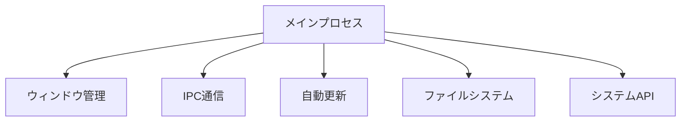
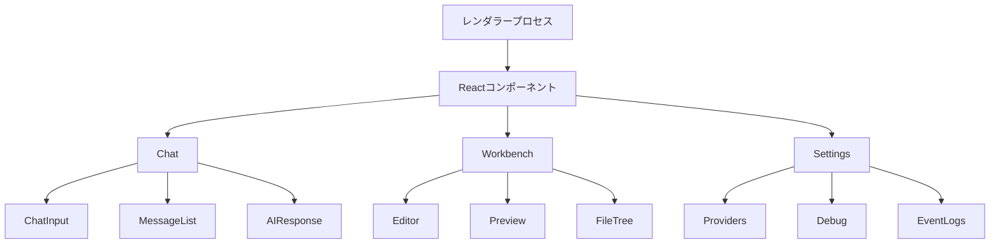
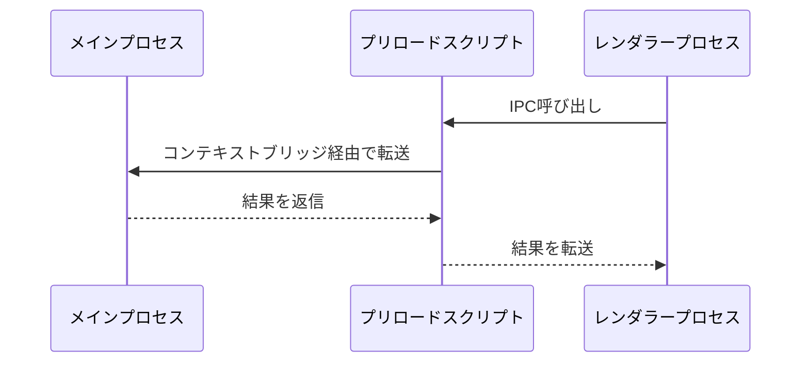
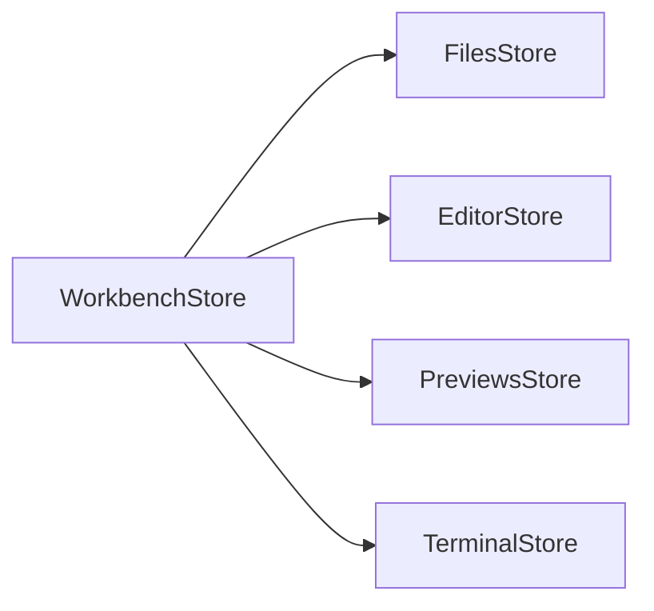

# Electron Bolt

Electron Boltは、高性能なデスクトップアプリケーションフレームワークです。ElectronとRemixを組み合わせることで、最新のWeb技術を活用しながら、ネイティブアプリケーションの機能を提供します。

## アーキテクチャ概要

Electron Boltは以下の主要なプロセスで構成されています：

### 1. メインプロセス (`electron/main/`)

メインプロセスはアプリケーションのライフサイクルを管理し、以下の責務を持ちます：

- システムレベルの機能へのアクセス
- ウィンドウ管理
- アプリケーションの状態管理
- ネイティブAPI（ファイルシステム、クリップボードなど）の提供
- 自動更新の制御



### 2. レンダラープロセス (`app/`)

RemixベースのUIを提供し、以下の機能を実装：

#### コンポーネント構造



#### 生成AI対話処理

1. **対話フロー**
   - `Chat`コンポーネントがユーザー入力を管理
   - 入力はAIプロバイダー（OpenAI, HuggingFaceなど）に送信
   - レスポンスはストリーミングで受信し、リアルタイム表示

2. **コンテキスト管理**
   - ファイルシステムの状態を`FilesStore`で管理
   - 対話履歴は`ChatHistory`で保持
   - コードスニペットは`WorkbenchStore`で処理

3. **プロンプト生成と送信例**

サンプルケース1: コードの実装要求
```
ユーザー: "Reactでカウンターを作成してください"

1. プロンプト前処理:
- モデル情報の追加: [Model: gpt-4]
- プロバイダー情報の追加: [Provider: OpenAI]
- コンテキスト最適化による関連ファイルの選択
- 現在の会話サマリーの追加

2. システムプロンプト:
- WebContainer環境の制約説明
- Viteの使用推奨
- コーディング規約とベストプラクティス
- アーティファクトの使用方法

3. 送信されるメッセージ構造:
{
  messages: [
    {systemMessage}, 
    {chatSummary},
    {userMessage: "[Model: gpt-4]\n[Provider: OpenAI]\nReactでカウンターを作成してください"}
  ]
}
```

サンプルケース2: デバッグ支援
```
ユーザー: "APIが動作しません"

1. プロンプト強化:
- エラーの具体的な状況の確認要求
- エラーメッセージの要求
- 実行環境の確認

2. コンテキスト収集:
- 関連するAPIファイルの特定
- エラーログの確認
- 設定ファイルの確認

3. 送信されるプロンプト:
"[Model: gpt-4]\n[Provider: OpenAI]\n
以下の点について確認させてください：
- 発生している具体的なエラー内容
- APIのエンドポイントURL
- 実行環境とバージョン情報
- エラーログの内容
これらの情報をご提供いただけますでしょうか？"
```

4. **AIレスポンスの形式と処理**

a) レスポンスの構造化形式:
```xml
<boltArtifact id="unique-id" title="Artifact Title" type="bundled">
  <boltAction type="file" filePath="path/to/file">
    // ファイルの内容
  </boltAction>
  
  <boltAction type="shell">
    // シェルコマンド
  </boltAction>
  
  <boltAction type="start">
    // 開発サーバー起動コマンド
  </boltAction>
</boltArtifact>
```

b) メッセージパース処理:
- StreamingMessageParserクラスによる段階的な解析
- アーティファクトとアクションのタグの検出と解析
- コールバックベースのイベント処理:
  1. onArtifactOpen: 新しいアーティファクトの開始
  2. onArtifactClose: アーティファクトの終了
  3. onActionOpen: アクション定義の開始
  4. onActionStream: ファイル内容のストリーミング
  5. onActionClose: アクションの完了

c) アクションの実行フロー:
1. ファイル操作 (type="file")
   - ファイルパスの正規化
   - WorkbenchStoreでのファイル内容の管理
   - エディタでの表示と編集

2. シェルコマンド (type="shell")
   - WebContainer環境での実行
   - 実行状態の監視
   - 出力のストリーミング表示

3. 開発サーバー (type="start")
   - サーバー起動の制御
   - プレビューの自動更新
   - ポート管理

d) 状態管理:
```typescript
interface ActionState {
  status: 'pending' | 'running' | 'complete' | 'failed' | 'aborted'
  type: 'file' | 'shell' | 'start'
  content: string
  filePath?: string
}
```

e) エラーハンドリング:
- 構文エラーの検出と回復
- アクション実行時のエラー処理
- コンテキスト整合性の検証

f) アノテーション:
- コンテキスト情報 (codeContext)
- 使用トークン数 (usage)
- チャットサマリー (chatSummary)
- 進捗状態 (progress)

5. **レスポンス構造化のシステムレベル指定**

a) プロンプト内での指示:
```
<artifact_instructions>
  1. 応答生成前の包括的分析:
    - プロジェクト全体のファイル構成の把握
    - 既存の変更履歴の確認
    - 依存関係の分析
    - システム全体への影響評価

  2. タグ構造の厳格な規定:
    - boltArtifactタグの必須属性:
      - id: 一意の識別子（kebab-case形式）
      - title: アーティファクトの説明的なタイトル
      - type: オプショナルな種別指定

    - boltActionタグの種別:
      - file: ファイル作成/更新（filePath属性必須）
      - shell: シェルコマンド実行
      - start: 開発サーバー起動
      - supabase: データベース操作

  3. アクション実行順序の制御:
    - 依存関係のインストールを最優先
    - ファイル作成はコマンド実行前
    - 開発サーバー起動は最後
</artifact_instructions>
```

b) 応答フォーマットの制約:
- Markdown形式のみ使用可（HTMLタグは不可）
- アーティファクト内での説明は最小限
- ファイル内容は完全な形で提供（部分更新不可）
- アクションの連鎖は &&で結合

c) エラー防止メカニズム:
- 必須属性の検証
- ファイルパスの正規化
- アクションタイプの厳格な型チェック
- 依存関係の整合性確認

d) 特別な処理規則:
- 開発サーバー再起動の制限（ファイル更新時は不要）
- 移行ファイルの完全性保証（差分更新不可）
- 大規模ファイルの自動分割
- コンテキスト最適化による関連ファイルの選択

これらの指定により、AIの応答は一貫した構造を持ち、システムによって安全に処理・実行できる形式に強制されます。

### 3. プリロードスクリプト (`electron/preload/`)

メインプロセスとレンダラープロセス間の安全な通信を提供：

- コンテキストブリッジの設定
- IPCチャネルの定義
- セキュリティポリシーの実装

## データフロー

### プロセス間通信（IPC）



1. **ファイル操作のフロー**
   - レンダラープロセスがファイル操作をリクエスト
   - プリロードスクリプトが安全なチャネルで転送
   - メインプロセスがネイティブAPIを使用して操作を実行
   - 結果を同じ経路で返信

2. **システム情報の取得**
   - レンダラープロセスがシステム情報をリクエスト
   - メインプロセスがOS APIを使用して情報を取得
   - 情報をIPC経由でレンダラーに返信

### ステート管理



1. **WorkbenchStore**
   - アプリケーション全体の状態を管理
   - 各種ストアの調整
   - UIの状態管理

2. **FilesStore**
   - ファイルシステムの操作
   - ファイル監視
   - 変更の同期

3. **EditorStore**
   - エディタの状態管理
   - カーソル位置
   - 選択範囲
   - 未保存の変更

4. **PreviewsStore**
   - プレビューの管理
   - WebContainerとの連携
   - プレビューの更新

## セキュリティ

1. **コンテキストの分離**
   - メインプロセスとレンダラープロセスの厳格な分離
   - コンテキストブリッジによる制御された通信

2. **IPC通信のセキュリティ**
   - 許可された操作のみを公開
   - 入力値の検証
   - 非同期通信の適切なエラーハンドリング

3. **ファイルシステムのアクセス制御**
   - サンドボックス化されたファイルアクセス
   - パスの検証
   - 権限の確認

## 開発ガイドライン

1. **プロセス間通信**
   - 新しいIPC機能の追加時は必ずプリロードスクリプトを経由
   - TypeScriptの型定義を活用して安全性を確保
   - エラーハンドリングを適切に実装

2. **状態管理**
   - ストアの責務を明確に分離
   - リアクティブな更新を活用
   - 不要な再レンダリングを防ぐ最適化

3. **パフォーマンス**
   - 重い処理はメインプロセスで実行
   - WebContainerの効率的な利用
   - メモリリークの防止

## ビルドとデプロイ

アプリケーションは以下の環境で動作します：

- macOS (x64, arm64)
- Windows
- Linux

ビルドプロセスは`electron-builder`を使用し、以下の機能を提供：

- 自動更新
- コード署名
- インストーラーの生成

# コーディング規約とベストプラクティス

## 1. 基本原則

### a) コード品質
- 可読性の高い、メンテナンス可能なコードの作成
- 一貫したフォーマットとネーミング規則の遵守
- モジュール化と再利用可能なコンポーネントの設計

### b) ファイル構造
```typescript
// 推奨されるファイルサイズと構造
const FILE_GUIDELINES = {
  maxLines: 250,          // 1ファイルの最大行数
  componentLimit: 100,    // Reactコンポーネントの最大行数
  moduleLimit: 150,       // ユーティリティモジュールの最大行数
  testRatio: 1.5         // テストコードと実装コードの比率目標
};
```

## 2. コーディングスタイル

### a) TypeScript/JavaScript
```typescript
// 推奨される記述スタイル
interface StyleGuidelines {
  indentation: '2 spaces';     // インデント
  quotes: 'single';            // 文字列クォート
  semicolons: 'always';        // セミコロン
  brackets: 'same-line';       // 波括弧
}

// 良い例
function calculateTotal(items: Item[]): number {
  return items.reduce((sum, item) => {
    return sum + item.price;
  }, 0);
}

// 避けるべき例
function calculateTotal(items: Item[]) 
{
  var total = 0
  for(var i=0;i<items.length;i++)
  {
    total+=items[i].price
  }
  return total
}
```

### b) Reactコンポーネント
```tsx
// コンポーネントの基本構造
interface ComponentStructure {
  imports: 'grouped by type';
  interfaces: 'top of file';
  hooks: 'before render';
  helpers: 'after hooks';
  render: 'last';
}

// 推奨される実装例
import { useEffect, useState } from 'react';
import { classNames } from '~/utils/classNames';

interface Props {
  data: DataType;
  onUpdate: (data: DataType) => void;
}

export const ExampleComponent: React.FC<Props> = ({ data, onUpdate }) => {
  const [state, setState] = useState(initialState);

  useEffect(() => {
    // 副作用の処理
  }, [data]);

  const handleChange = () => {
    // イベントハンドラの実装
  };

  return (
    <div className={classNames('base-class', { 'active': state.isActive })}>
      {/* JSX実装 */}
    </div>
  );
};
```

## 3. プロジェクト規約

### a) ファイル命名規則
```text
components/         
  ├── feature/      - 機能単位のコンポーネント
  │   └── PascalCase.tsx
  ├── common/       - 共通コンポーネント
  │   └── PascalCase.tsx
  └── layouts/      - レイアウトコンポーネント
      └── PascalCase.tsx

hooks/              
  └── camelCase.ts  - カスタムフック

utils/              
  └── camelCase.ts  - ユーティリティ関数

types/              
  └── PascalCase.ts - 型定義
```

### b) インポート順序
```typescript
// 1. React/フレームワークインポート
import { useState } from 'react';

// 2. サードパーティライブラリ
import { classNames } from 'classnames';

// 3. プロジェクト内の型定義
import type { DataType } from '~/types';

// 4. コンポーネント/フック
import { useCustomHook } from '~/hooks';

// 5. ユーティリティ/定数
import { formatDate } from '~/utils';

// 6. スタイル
import styles from './Component.module.scss';
```

## 4. エラーハンドリング

### a) 基本原則
```typescript
// エラーハンドリングの階層構造
interface ErrorHandlingLayers {
  presentation: 'コンポーネントレベルでのUI表示';
  business: 'ビジネスロジックでの処理';
  data: 'データアクセス層での捕捉';
  global: 'アプリケーション全体のフォールバック';
}

// 実装例
try {
  await dataOperation();
} catch (error) {
  if (error instanceof NetworkError) {
    notifyUser('ネットワークエラー');
  } else if (error instanceof ValidationError) {
    showValidationErrors(error.details);
  } else {
    reportToErrorTracking(error);
  }
}
```

### b) エラーバウンダリ
```tsx
class ErrorBoundary extends React.Component<Props, State> {
  static getDerivedStateFromError(error: Error) {
    return { hasError: true, error };
  }

  componentDidCatch(error: Error, errorInfo: React.ErrorInfo) {
    logErrorToService(error, errorInfo);
  }

  render() {
    if (this.state.hasError) {
      return <ErrorFallback error={this.state.error} />;
    }
    return this.props.children;
  }
}
```

## 5. パフォーマンス最適化

### a) レンダリング最適化
```typescript
// メモ化のベストプラクティス
interface MemoizationGuidelines {
  components: 'props比較が妥当な場合のみ使用';
  callbacks: 'useCallbackで依存関係を明示';
  values: 'useMemoで計算コストの高い処理を最適化';
}

// 実装例
const MemoizedComponent = React.memo(({ data }) => (
  <ExpensiveRendering data={data} />
));

const handleChange = useCallback(() => {
  process(dependencies);
}, [dependencies]);

const computedValue = useMemo(() => {
  return expensiveComputation(data);
}, [data]);
```

### b) バンドルサイズの最適化
```typescript
// コード分割の指針
interface CodeSplittingGuidelines {
  routes: 'ページ単位でのコード分割';
  components: '大きなコンポーネントの遅延ロード';
  modules: '重いサードパーティモジュールの分割';
}

// 実装例
const HeavyComponent = lazy(() => 
  import('./HeavyComponent')
);

<Suspense fallback={<Loading />}>
  <HeavyComponent />
</Suspense>
```

## 6. テスト規約

### a) テスト構造
```typescript
// テストファイルの基本構造
describe('ComponentName', () => {
  // セットアップ
  beforeEach(() => {
    // テスト環境の準備
  });

  // 機能テスト
  it('should handle primary functionality', () => {
    // テスト実装
  });

  // エッジケース
  it('should handle edge cases', () => {
    // エッジケースのテスト
  });

  // クリーンアップ
  afterEach(() => {
    // テスト環境のクリーンアップ
  });
});
```

### b) テストカバレッジ要件
```typescript
interface CoverageRequirements {
  statements: '最低80%のステートメントカバレッジ';
  branches: '最低70%の分岐カバレッジ';
  functions: '最低90%の関数カバレッジ';
  lines: '最低80%の行カバレッジ';
}
```

これらの規約と実践により、コードベースの品質、保守性、パフォーマンスが向上し、開発者の生産性も高まります。また、新しい機能の追加や既存コードの修正がより安全かつ効率的に行えるようになります。

# コンテキスト最適化の詳細

## 1. コンテキスト最適化の概要

### a) 最適化の目的
- 大規模なコードベースからの効率的な関連ファイルの抽出
- トークン数の削減とコスト最適化
- 応答品質の向上

### b) 主要コンポーネント
```typescript
interface ContextOptimizationProps {
  messages: Message[];         // 対話履歴
  files: FileMap;             // プロジェクトファイル
  summary: string;            // 対話サマリー
  contextFiles?: FileMap;     // 最適化されたコンテキスト
}
```

## 2. 最適化プロセス

### a) チャットサマリーの生成（create-summary.ts）
```typescript
// サマリー生成の構造化フォーマット
interface ChatSummary {
  project: {
    name: string;
    phase: string;
    techStack: string[];
  };
  context: {
    lastTopic: string;
    decisions: string[];
    userPreferences: {
      technicalLevel: string;
      codingStyle: string[];
    }
  };
  implementation: {
    currentState: string;
    activeFeature: string;
  };
}
```

### b) コンテキスト選択プロセス（select-context.ts）

1. 現在のコンテキストの分析:
```typescript
const { codeContext } = extractCurrentContext(messages);
if (codeContext?.type === 'codeContext') {
  // 既存のコンテキストファイルを保持
  Object.keys(files).forEach((path) => {
    if (codeContext.files.includes(path)) {
      contextFiles[path] = files[path];
    }
  });
}
```

2. ファイルの選択:
```typescript
// コンテキストバッファーの更新命令フォーマット
<updateContextBuffer>
  <includeFile path="関連ファイルパス"/>
  <excludeFile path="不要なファイルパス"/>
</updateContextBuffer>
```

3. 最適化ルール:
- バッファーサイズの制限（最大5ファイル）
- 関連性に基づく優先順位付け
- 差分更新による効率化

## 3. 実装の詳細

### a) ストリーミング時の処理（stream-text.ts）
```typescript
if (files && contextFiles && contextOptimization) {
  // システムプロンプトにコンテキスト情報を追加
  systemPrompt = `${systemPrompt}
    Below are all the files present in the project:
    ---
    ${filePaths.join('\n')}
    ---
    CONTEXT BUFFER:
    ---
    ${codeContext}
    ---
  `;
}
```

### b) アノテーション管理
```typescript
interface ContextAnnotation {
  type: 'codeContext';
  files: string[];           // 関連ファイルパス
  messageId?: string;        // 関連メッセージID
}
```

### c) パフォーマンス最適化:
1. ファイル除外パターン:
```typescript
const IGNORE_PATTERNS = [
  'node_modules/**',
  '.git/**',
  'dist/**',
  '**/*.log'
];
```

2. インクリメンタルアップデート:
```typescript
const currentFiles = new Set(contextFiles.keys());
includeFiles.forEach(path => {
  if (!currentFiles.has(path)) {
    filteredFiles[path] = files[path];
  }
});
```

## 4. エラーハンドリングとフォールバック

### a) エラー検出
- 不正なファイルパス
- コンテキストバッファーの上限超過
- 必須ファイルの欠落

### b) リカバリー戦略
1. 自動フォールバック:
```typescript
if (totalFiles === 0) {
  // 最低限必要なファイルを含める
  return {
    'package.json': files['package.json'],
    'tsconfig.json': files['tsconfig.json']
  };
}
```

2. インクリメンタルリカバリー:
- 部分的なコンテキスト保持
- 段階的な再最適化

## 5. モニタリングと分析

### a) メトリクス収集
- コンテキストサイズ
- 選択精度
- 応答品質との相関

### b) 最適化フィードバック
- ユーザーの修正パターン
- ファイル選択の学習
- コンテキスト依存関係の分析

これらの実装により、AIはプロジェクトのコンテキストを効率的に理解し、より適切な応答を生成することが可能になります。また、トークン使用量の最適化とレスポンス品質の向上を両立させています。