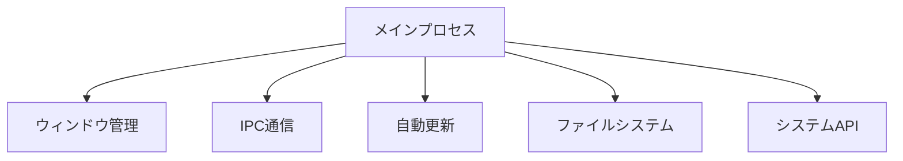
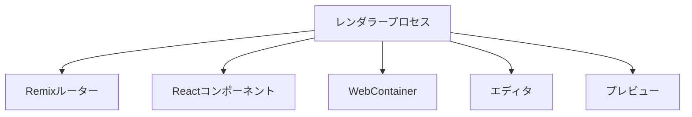
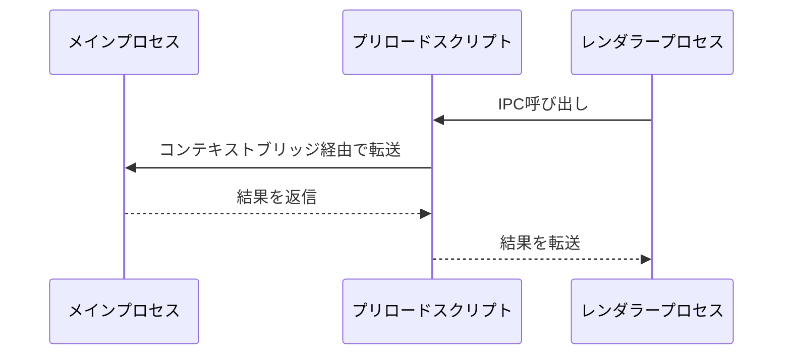
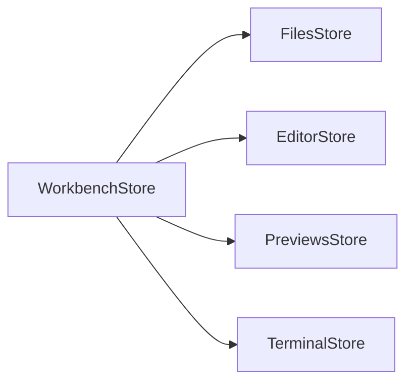

# Electron Bolt

Electron Boltは、高性能なデスクトップアプリケーションフレームワークです。ElectronとRemixを組み合わせることで、最新のWeb技術を活用しながら、ネイティブアプリケーションの機能を提供します。

## アーキテクチャ概要

Electron Boltは以下の主要なプロセスで構成されています：

### 1. メインプロセス (`electron/main/`)

メインプロセスはアプリケーションのライフサイクルを管理し、以下の責務を持ちます：

- システムレベルの機能へのアクセス
- ウィンドウ管理
- アプリケーションの状態管理
- ネイティブAPI（ファイルシステム、クリップボードなど）の提供
- 自動更新の制御

### 2. レンダラープロセス (`app/`)

RemixベースのUIを提供し、以下の機能を実装：

- ユーザーインターフェース
- エディタ機能
- プレビュー機能
- ファイル操作
- WebContainerとの連携

### 3. プリロードスクリプト (`electron/preload/`)

メインプロセスとレンダラープロセス間の安全な通信を提供：

- コンテキストブリッジの設定
- IPCチャネルの定義
- セキュリティポリシーの実装

## データフロー

### プロセス間通信（IPC）

1. **ファイル操作のフロー**
   - レンダラープロセスがファイル操作をリクエスト
   - プリロードスクリプトが安全なチャネルで転送
   - メインプロセスがネイティブAPIを使用して操作を実行
   - 結果を同じ経路で返信

2. **システム情報の取得**
   - レンダラープロセスがシステム情報をリクエスト
   - メインプロセスがOS APIを使用して情報を取得
   - 情報をIPC経由でレンダラーに返信

### ステート管理

1. **WorkbenchStore**
   - アプリケーション全体の状態を管理
   - 各種ストアの調整
   - UIの状態管理

2. **FilesStore**
   - ファイルシステムの操作
   - ファイル監視
   - 変更の同期

3. **EditorStore**
   - エディタの状態管理
   - カーソル位置
   - 選択範囲
   - 未保存の変更

4. **PreviewsStore**
   - プレビューの管理
   - WebContainerとの連携
   - プレビューの更新

## セキュリティ

1. **コンテキストの分離**
   - メインプロセスとレンダラープロセスの厳格な分離
   - コンテキストブリッジによる制御された通信

2. **IPC通信のセキュリティ**
   - 許可された操作のみを公開
   - 入力値の検証
   - 非同期通信の適切なエラーハンドリング

3. **ファイルシステムのアクセス制御**
   - サンドボックス化されたファイルアクセス
   - パスの検証
   - 権限の確認

## 開発ガイドライン

1. **プロセス間通信**
   - 新しいIPC機能の追加時は必ずプリロードスクリプトを経由
   - TypeScriptの型定義を活用して安全性を確保
   - エラーハンドリングを適切に実装

2. **状態管理**
   - ストアの責務を明確に分離
   - リアクティブな更新を活用
   - 不要な再レンダリングを防ぐ最適化

3. **パフォーマンス**
   - 重い処理はメインプロセスで実行
   - WebContainerの効率的な利用
   - メモリリークの防止

## ビルドとデプロイ

アプリケーションは以下の環境で動作します：

- macOS (x64, arm64)
- Windows
- Linux

ビルドプロセスは`electron-builder`を使用し、以下の機能を提供：

- 自動更新
- コード署名
- インストーラーの生成