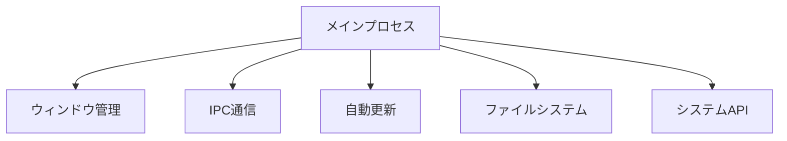
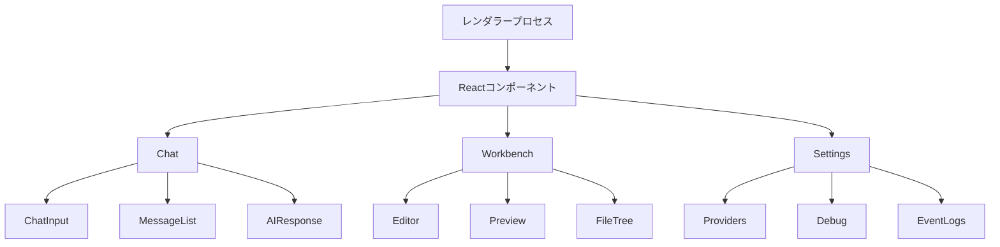
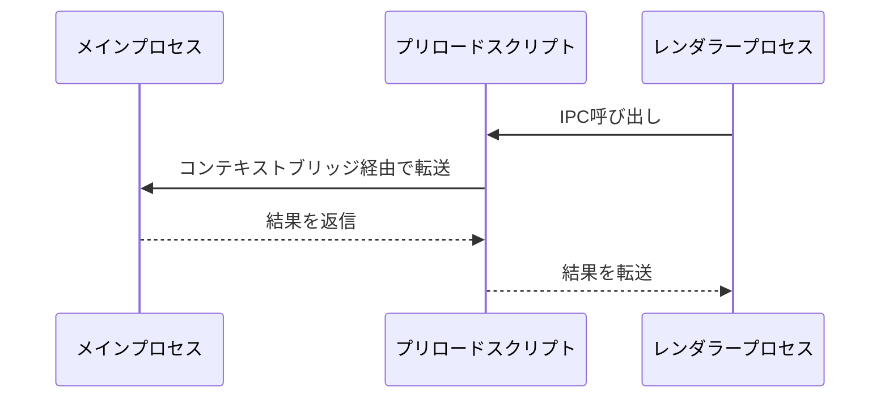
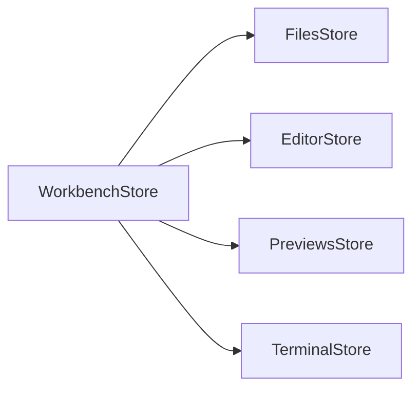

# Electron Bolt

Electron Boltは、高性能なデスクトップアプリケーションフレームワークです。ElectronとRemixを組み合わせることで、最新のWeb技術を活用しながら、ネイティブアプリケーションの機能を提供します。

## アーキテクチャ概要

Electron Boltは以下の主要なプロセスで構成されています：

### 1. メインプロセス (`electron/main/`)

メインプロセスはアプリケーションのライフサイクルを管理し、以下の責務を持ちます：

- システムレベルの機能へのアクセス
- ウィンドウ管理
- アプリケーションの状態管理
- ネイティブAPI（ファイルシステム、クリップボードなど）の提供
- 自動更新の制御



### 2. レンダラープロセス (`app/`)

RemixベースのUIを提供し、以下の機能を実装：

#### コンポーネント構造



#### 生成AI対話処理

1. **対話フロー**
   - `Chat`コンポーネントがユーザー入力を管理
   - 入力はAIプロバイダー（OpenAI, HuggingFaceなど）に送信
   - レスポンスはストリーミングで受信し、リアルタイム表示

2. **コンテキスト管理**
   - ファイルシステムの状態を`FilesStore`で管理
   - 対話履歴は`ChatHistory`で保持
   - コードスニペットは`WorkbenchStore`で処理

3. **プロンプト生成と送信例**

サンプルケース1: コードの実装要求
```
ユーザー: "Reactでカウンターを作成してください"

1. プロンプト前処理:
- モデル情報の追加: [Model: gpt-4]
- プロバイダー情報の追加: [Provider: OpenAI]
- コンテキスト最適化による関連ファイルの選択
- 現在の会話サマリーの追加

2. システムプロンプト:
- WebContainer環境の制約説明
- Viteの使用推奨
- コーディング規約とベストプラクティス
- アーティファクトの使用方法

3. 送信されるメッセージ構造:
{
  messages: [
    {systemMessage}, 
    {chatSummary},
    {userMessage: "[Model: gpt-4]\n[Provider: OpenAI]\nReactでカウンターを作成してください"}
  ]
}
```

サンプルケース2: デバッグ支援
```
ユーザー: "APIが動作しません"

1. プロンプト強化:
- エラーの具体的な状況の確認要求
- エラーメッセージの要求
- 実行環境の確認

2. コンテキスト収集:
- 関連するAPIファイルの特定
- エラーログの確認
- 設定ファイルの確認

3. 送信されるプロンプト:
"[Model: gpt-4]\n[Provider: OpenAI]\n
以下の点について確認させてください：
- 発生している具体的なエラー内容
- APIのエンドポイントURL
- 実行環境とバージョン情報
- エラーログの内容
これらの情報をご提供いただけますでしょうか？"
```

4. **AIレスポンスの形式と処理**

a) レスポンスの構造化形式:
```xml
<boltArtifact id="unique-id" title="Artifact Title" type="bundled">
  <boltAction type="file" filePath="path/to/file">
    // ファイルの内容
  </boltAction>
  
  <boltAction type="shell">
    // シェルコマンド
  </boltAction>
  
  <boltAction type="start">
    // 開発サーバー起動コマンド
  </boltAction>
</boltArtifact>
```

b) メッセージパース処理:
- StreamingMessageParserクラスによる段階的な解析
- アーティファクトとアクションのタグの検出と解析
- コールバックベースのイベント処理:
  1. onArtifactOpen: 新しいアーティファクトの開始
  2. onArtifactClose: アーティファクトの終了
  3. onActionOpen: アクション定義の開始
  4. onActionStream: ファイル内容のストリーミング
  5. onActionClose: アクションの完了

c) アクションの実行フロー:
1. ファイル操作 (type="file")
   - ファイルパスの正規化
   - WorkbenchStoreでのファイル内容の管理
   - エディタでの表示と編集

2. シェルコマンド (type="shell")
   - WebContainer環境での実行
   - 実行状態の監視
   - 出力のストリーミング表示

3. 開発サーバー (type="start")
   - サーバー起動の制御
   - プレビューの自動更新
   - ポート管理

d) 状態管理:
```typescript
interface ActionState {
  status: 'pending' | 'running' | 'complete' | 'failed' | 'aborted'
  type: 'file' | 'shell' | 'start'
  content: string
  filePath?: string
}
```

e) エラーハンドリング:
- 構文エラーの検出と回復
- アクション実行時のエラー処理
- コンテキスト整合性の検証

f) アノテーション:
- コンテキスト情報 (codeContext)
- 使用トークン数 (usage)
- チャットサマリー (chatSummary)
- 進捗状態 (progress)

5. **レスポンス構造化のシステムレベル指定**

a) プロンプト内での指示:
```
<artifact_instructions>
  1. 応答生成前の包括的分析:
    - プロジェクト全体のファイル構成の把握
    - 既存の変更履歴の確認
    - 依存関係の分析
    - システム全体への影響評価

  2. タグ構造の厳格な規定:
    - boltArtifactタグの必須属性:
      - id: 一意の識別子（kebab-case形式）
      - title: アーティファクトの説明的なタイトル
      - type: オプショナルな種別指定

    - boltActionタグの種別:
      - file: ファイル作成/更新（filePath属性必須）
      - shell: シェルコマンド実行
      - start: 開発サーバー起動
      - supabase: データベース操作

  3. アクション実行順序の制御:
    - 依存関係のインストールを最優先
    - ファイル作成はコマンド実行前
    - 開発サーバー起動は最後
</artifact_instructions>
```

b) 応答フォーマットの制約:
- Markdown形式のみ使用可（HTMLタグは不可）
- アーティファクト内での説明は最小限
- ファイル内容は完全な形で提供（部分更新不可）
- アクションの連鎖は &&で結合

c) エラー防止メカニズム:
- 必須属性の検証
- ファイルパスの正規化
- アクションタイプの厳格な型チェック
- 依存関係の整合性確認

d) 特別な処理規則:
- 開発サーバー再起動の制限（ファイル更新時は不要）
- 移行ファイルの完全性保証（差分更新不可）
- 大規模ファイルの自動分割
- コンテキスト最適化による関連ファイルの選択

これらの指定により、AIの応答は一貫した構造を持ち、システムによって安全に処理・実行できる形式に強制されます。

### 3. プリロードスクリプト (`electron/preload/`)

メインプロセスとレンダラープロセス間の安全な通信を提供：

- コンテキストブリッジの設定
- IPCチャネルの定義
- セキュリティポリシーの実装

## データフロー

### プロセス間通信（IPC）



1. **ファイル操作のフロー**
   - レンダラープロセスがファイル操作をリクエスト
   - プリロードスクリプトが安全なチャネルで転送
   - メインプロセスがネイティブAPIを使用して操作を実行
   - 結果を同じ経路で返信

2. **システム情報の取得**
   - レンダラープロセスがシステム情報をリクエスト
   - メインプロセスがOS APIを使用して情報を取得
   - 情報をIPC経由でレンダラーに返信

### ステート管理



1. **WorkbenchStore**
   - アプリケーション全体の状態を管理
   - 各種ストアの調整
   - UIの状態管理

2. **FilesStore**
   - ファイルシステムの操作
   - ファイル監視
   - 変更の同期

3. **EditorStore**
   - エディタの状態管理
   - カーソル位置
   - 選択範囲
   - 未保存の変更

4. **PreviewsStore**
   - プレビューの管理
   - WebContainerとの連携
   - プレビューの更新

## セキュリティ

1. **コンテキストの分離**
   - メインプロセスとレンダラープロセスの厳格な分離
   - コンテキストブリッジによる制御された通信

2. **IPC通信のセキュリティ**
   - 許可された操作のみを公開
   - 入力値の検証
   - 非同期通信の適切なエラーハンドリング

3. **ファイルシステムのアクセス制御**
   - サンドボックス化されたファイルアクセス
   - パスの検証
   - 権限の確認

## 開発ガイドライン

1. **プロセス間通信**
   - 新しいIPC機能の追加時は必ずプリロードスクリプトを経由
   - TypeScriptの型定義を活用して安全性を確保
   - エラーハンドリングを適切に実装

2. **状態管理**
   - ストアの責務を明確に分離
   - リアクティブな更新を活用
   - 不要な再レンダリングを防ぐ最適化

3. **パフォーマンス**
   - 重い処理はメインプロセスで実行
   - WebContainerの効率的な利用
   - メモリリークの防止

## ビルドとデプロイ

アプリケーションは以下の環境で動作します：

- macOS (x64, arm64)
- Windows
- Linux

ビルドプロセスは`electron-builder`を使用し、以下の機能を提供：

- 自動更新
- コード署名
- インストーラーの生成